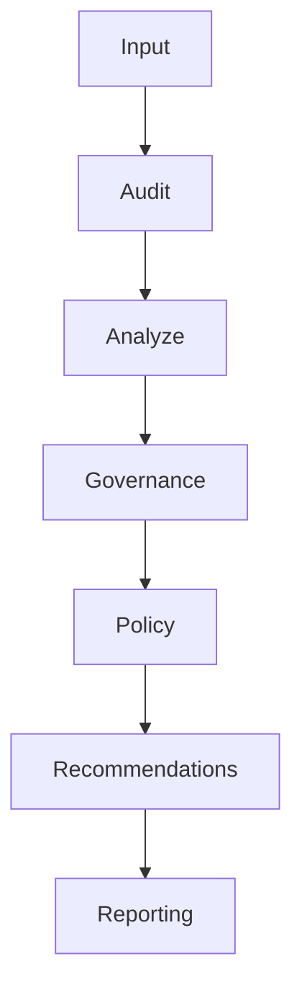

# Mem-D

Local-first CLI for evidence-based memory intelligence.

Mem-D answers: **what is in memory, which signals are trustworthy, and what governance recommendations should be considered next**.

## Status

- **Version:** v0.6.0
- **Scope:** Read-only CLI analysis, governance recommendations, and recommendation evaluation
- **Execution boundary:** Mem-D does not mutate memory and does not run autonomous actions

## Features

- Parse memory exports: JSON, JSONL, CSV, TXT
- Heuristic categorization (Preference, Fact, Task, Goal, Relationship, Temporary, Unknown)
- Semantic duplicate clustering (DBSCAN + cosine similarity)
- Metrics: category distribution, duplicate %, trusted vs unverified compression
- Ranked, rule-based insights and governance action planning
- Recommendation layer with deterministic memory-level resolution (`merge`, `archive`, `review`, `keep`)
- Recommendation quality benchmarking against gold fixtures (ADR-002)
- Output: terminal report, JSON, Markdown

## Product progression

Mem-D v0.6 progression:

**Memory Analysis -> Governance -> Recommendations -> Evaluation -> Future Simulation / Workflows / Actions**

Current implementation state:

- Recommendations: implemented
- Recommendation evaluation: implemented
- Simulation layer: not implemented
- Workflow automation: not implemented
- Memory mutation/execution: not implemented

## Architecture



The recommendation layer is read-only and evidence-driven. It is a foundation for future simulation/workflow/action layers, not an execution system.

## Recommendation Engine

Mem-D emits four recommendation actions:

- **Merge**: consolidate trusted duplicate/preference clusters
- **Archive**: retire superseded, deprecated, historical, temporary, or completed memories
- **Review**: escalate ambiguity, low trust, policy blocks, or conflicts
- **Keep**: retain stable active memories with no stronger remediation signal

Recommendations are generated from existing pipeline evidence:

- Governance actions
- Lifecycle signals
- Evolution signals
- Trust analysis
- Policy decisions

Conflict handling is deterministic and safety-biased, with precedence and conflict resolution producing one authoritative `resolvedAction` per memory.

## Recommendation Evaluation

Recommendation quality is benchmarked under [ADR-002](docs/design/ADR-002-RECOMMENDATION-EVALUATION.md) using labeled gold cases (`tests/fixtures/recommendation_gold.json`).

Current published results:

- Overall accuracy: **1.0000 (22/22)**
- Merge accuracy: **1.0000 (3/3)**
- Archive accuracy: **1.0000 (5/5)**
- Review accuracy: **1.0000 (11/11)**
- Keep accuracy: **1.0000 (3/3)**
- Conflict resolution accuracy: **1.0000 (3/3)**

Artifacts:

- `examples/benchmarks/recommendation_evaluation.md`
- `examples/benchmarks/recommendation_evaluation.json`

## Requirements

- Python 3.10+
- Windows, macOS, or Linux

## Install

```bash
git clone <https://github.com/2Cloud-S/mem-d>
cd mem-d

python -m pip install -e ".[dev]"
```

Optional — better semantic duplicate detection with local embedding models:

```bash
python -m pip install -e ".[dev,embeddings]"
```

## Quick start

```bash
# Help
python -m memd --help

# Analyze a memory export (terminal report)
python -m memd analyze tests/fixtures/memories.json

# JSON output
python -m memd analyze memory.json --format json

# Markdown report to file
python -m memd analyze memory.json --format markdown --output report.md

# Tune similarity threshold after evaluation
python -m memd analyze memory.json --threshold 0.55

# Use a local embedding model (requires [embeddings] extra)
python -m memd analyze memory.json --model BAAI/bge-small-en-v1.5
```

## Clustering evaluation

Use the labelled validation fixture to measure duplicate-clustering quality:

```bash
python -m memd evaluate-clusters datasets/validation/clustering_quality.json
python -m memd evaluate-clusters datasets/validation/clustering_quality.json --format json
python -m memd evaluate-clusters datasets/validation/clustering_quality.json --format markdown --output clustering-eval.md
```

The evaluation report includes precision, recall, F1, false positives, false negatives, cluster purity, cluster coverage, and examples of clustering mistakes.

The default threshold is `0.55`, chosen from the labelled validation fixture to improve near-duplicate recall while preserving high precision. See [docs/validation/CLUSTERING.md](docs/validation/CLUSTERING.md) for the measured tradeoffs.

## Benchmarking

Benchmark evidence lives in [examples/benchmarks/](examples/benchmarks/) and is summarized in [docs/validation/BENCHMARK-EVIDENCE-SUMMARY.md](docs/validation/BENCHMARK-EVIDENCE-SUMMARY.md).

Currently supported tracks:

- LongMemEval benchmark workflow
- Clustering evaluation
- Lifecycle evaluation
- Evolution evaluation
- Recommendation evaluation
- PERMA benchmark (user-level reproducible path, currently `user108`)

### Key benchmark highlights

- **LongMemEval (raw -> cleaned):** meaningful memory rate improved from `35.5%` to `83.42%`; cleaned analyze compression opportunity `26.72%`, trusted compression `3.44%`.
- **PERMA (`user108` export path):** reproducible pipeline with audit verdict `poor_fit`; analyze duplicate/compression `59.21%`, trusted compression `8.77%`.
- **Recommendation evaluation:** overall accuracy `1.0000 (22/22)` with conflict resolution accuracy `1.0000 (3/3)`.

### Reproduce benchmark tracks

```bash
# LongMemEval benchmark workflow
python scripts/run_longmemeval_benchmark.py datasets/evaluation/longmemeval_sample.jsonl

# PERMA benchmark (user-level)
python scripts/run_perma_benchmark.py --user-id user108

# Clustering evaluation
python -m memd evaluate-clusters datasets/validation/clustering_quality.json

# Lifecycle evaluation
python -m pytest tests/test_lifecycle_evaluation.py -q

# Evolution evaluation
python -m pytest tests/test_evolution_evaluation.py -q

# Recommendation evaluation
python scripts/run_recommendation_evaluation.py
```

### LongMemEval benchmark artifacts

The LongMemEval workflow writes artifacts to `examples/benchmarks/`:

| Artifact | Committed to git | Description |
| --- | --- | --- |
| `{stem}.audit.raw.md` | Yes | Raw dataset quality audit |
| `{stem}.audit.cleaned.md` | Yes | Cleaned dataset quality audit |
| `{stem}.preprocess-report.md` | Yes | Preprocessing summary |
| `{stem}.baseline.md` | Yes | One-page benchmark baseline |
| `{stem}.audit.*.json` | Yes | Machine-readable audit reports |
| `{stem}.preprocess-report.json` | Yes | Machine-readable preprocess report |
| `{stem}.cleaned.jsonl` | No | Cleaned memory export (large) |
| `{stem}.analysis.json` / `.md` | No | Full analyze report (large) |

## Dataset quality audit

Before using external datasets such as LongMemEval as Mem-D benchmarks, audit memory usefulness:

```bash
python -m memd audit-dataset datasets/evaluation/longmemeval_sample.jsonl
python -m memd audit-dataset datasets/evaluation --format json
python -m memd audit-dataset datasets/evaluation/longmemeval_sample.jsonl --format markdown --output dataset-audit.md
```

The report estimates meaningful memories, conversational noise, Unknown rate, duplicate rate, and preprocessing needs. See [docs/validation/DATASET-QUALITY-AUDIT.md](docs/validation/DATASET-QUALITY-AUDIT.md).

## Input formats

### JSONL

One JSON object per line. Blank lines are ignored. Lines with empty `content` are skipped.

```jsonl
{"memory_id": "mem_1", "content": "User prefers dark mode"}
{"memory_id": "mem_2", "content": "User likes dark themes"}
```

### JSON

Array of objects, or an object with a `memories` / `items` / `records` key:

```json
[
  { "id": "mem_1", "content": "User prefers dark mode" },
  { "id": "mem_2", "content": "User likes dark themes" }
]
```

### CSV

Header row with at least a `content` column (also accepts `text`, `memory`, `message`).

### TXT

One memory per line.

## Roadmap

### Current (v0.6)

- Recommendation generation is implemented (ADR-001).
- Recommendation evaluation is implemented and benchmarked (ADR-002).

### Next layers (future, not yet implemented)

- Simulation layer (dry-run governance impact modeling)
- Workflow layer (structured recommendation orchestration)
- Action layer (external execution systems)

These future layers are intentionally gated behind validated recommendation quality and remain out of current implementation scope.

## Development

```bash
# Run tests
python -m pytest

# Lint
python -m ruff check .

# Benchmark (10k synthetic records)
python scripts/benchmark_10k.py
```

## Project layout

```
memd/              Python package (CLI + analysis pipeline)
tests/             Unit and CLI tests
docs/              Product & technical specifications
scripts/           Benchmarks and utilities
```

## Documentation


| Doc                                                            | Purpose                            |
| -------------------------------------------------------------- | ---------------------------------- |
| [docs/PRD.md](docs/PRD.md)                                     | Product requirements               |
| [docs/ARCHITECTURE.md](docs/ARCHITECTURE.md)                           | Architecture                       |
| [docs/DATA_CONTRACTS.md](docs/DATA_CONTRACTS.md)               | Data contracts                     |
| [docs/DECISIONS.md](docs/DECISIONS.md)                         | Architectural decisions            |
| [docs/INSIGHTS.md](docs/INSIGHTS.md)                           | Insight Engine rules and tradeoffs |
| [docs/ACTION-PLANNING.md](docs/ACTION-PLANNING.md)             | Governance action planning         |
| [docs/POLICY-ENGINE.md](docs/POLICY-ENGINE.md)                 | Governance policy decisions        |
| [docs/validation/CATEGORY-AUDIT-V2.md](docs/validation/CATEGORY-AUDIT-V2.md) | Unknown category diagnostics |
| [docs/validation/DATASET-QUALITY-AUDIT.md](docs/validation/DATASET-QUALITY-AUDIT.md) | External dataset usefulness audit |
| [docs/validation/BENCHMARK-WORKFLOW.md](docs/validation/BENCHMARK-WORKFLOW.md) | Reproducible benchmark pipeline |
| [docs/validation/BENCHMARK-EVIDENCE-SUMMARY.md](docs/validation/BENCHMARK-EVIDENCE-SUMMARY.md) | Current benchmark evidence and reproducibility status |
| [docs/design/ADR-001-RECOMMENDATION-LAYER.md](docs/design/ADR-001-RECOMMENDATION-LAYER.md) | Recommendation layer architecture decision |
| [docs/design/ADR-002-RECOMMENDATION-EVALUATION.md](docs/design/ADR-002-RECOMMENDATION-EVALUATION.md) | Recommendation evaluation decision and metrics |
| [docs/validation/V0.6-PHASE1-IMPLEMENTATION.md](docs/validation/V0.6-PHASE1-IMPLEMENTATION.md) | Recommendation layer implementation status |
| [docs/validation/V0.6-PHASE2-INTEGRATION.md](docs/validation/V0.6-PHASE2-INTEGRATION.md) | Recommendation pipeline/report integration status |
| [docs/validation/V0.6-PHASE3-IMPLEMENTATION.md](docs/validation/V0.6-PHASE3-IMPLEMENTATION.md) | Recommendation evaluation implementation status |
| [docs/validation/V0.6.1-RELEASE-HARDENING.md](docs/validation/V0.6.1-RELEASE-HARDENING.md) | Post-release hardening fixes and validation |
| [docs/validation/CLUSTER-AUDIT.md](docs/validation/CLUSTER-AUDIT.md) | Largest-cluster quality audit |
| [docs/validation/CLUSTERING.md](docs/validation/CLUSTERING.md) | Clustering validation metrics      |
| [AGENTS.md](AGENTS.md)                                         | Agent/contributor scope            |


## Design principles

- **Local first** — runs on your machine, no cloud required
- **Read only** — never modifies input files
- **Provider independent** — no OpenAI/Anthropic/Gemini dependency for core features
- **Explainable** — categories and clusters trace back to inputs

## License

MIT — see [LICENSE](LICENSE).