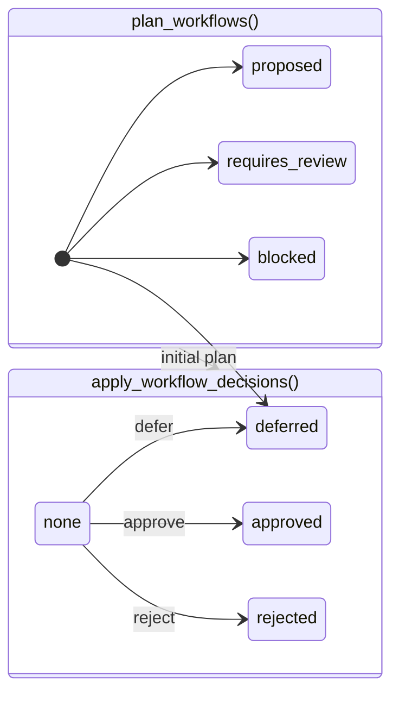

# ADR-004: V0.8 Workflow Planning Architecture

Status: Accepted (V0.8 architecture)

Target: V0.8

Date: 2026-06-19 (accepted 2026-06-19; audit dispositions incorporated)

Scope: architecture and decision record only. No code, tests, fixtures, schemas, runners, migrations, APIs, persistence, or workflow execution.

---

## 1. Status and Decision

**Status:** Accepted (V0.8 architecture)

**Target:** V0.8 — Workflow Planning and Evaluation

### Decision

Add a read-only **Workflow Planning Layer** that converts existing recommendation, policy, governance, and simulation outputs into deterministic, reviewable **workflow plans**.

The workflow layer:

1. Consumes `AnalysisReport` (including `simulationReport`) produced by `analyze_file()` — it does **not** recompute diagnostics, governance, policy, recommendations, or simulation.
2. Exposes two conceptual transformations:
   - **`plan_workflows(report, *, include_keep=False) -> WorkflowPlan`** — deterministic, immutable **initial plan** from upstream outputs only.
   - **`apply_workflow_decisions(plan, decisions) -> WorkflowPlan`** — pure, deterministic application of operator decisions to a copy of the initial plan. Does not persist or execute.
3. Groups eligible recommendations into ordered workflow items and steps suitable for human review.
4. Routes review-required, blocked, and deferred outcomes into explicit queues with simulation evidence attached.
5. Attaches the initial `workflowPlan` to the immutable `AnalysisReport` returned by the pipeline.
6. Defines structured operation intent on steps so a future executor (V1.0+) never parses human `description` fields.
7. Remains read-only with respect to source memories and all upstream analysis artifacts.

**Planner-generated state and operator decisions are separate.** `plan_workflows()` never emits operator `approved`, `rejected`, or `deferred`, and never produces `aggregateStatus == ready_for_execution` (S19). Operator outcomes and `ready_for_execution` exist only after `apply_workflow_decisions()`.

V0.8 plans and evaluates operational work packaging. V0.8 does **not** execute memory changes, persist workflow state, schedule background jobs, or integrate with external orchestration systems.

### Roadmap terminology

| Release | Scope |
| --- | --- |
| **V0.8** | Workflow Planning and Evaluation |
| **V0.9** | Action Architecture (contracts and dry-run handoff design; no execution) |
| **V1.0** | Execution-capable release, subject to a separate accepted ADR |

---

## 2. Problem Statement

Mem-D V0.7 can answer:

- What is inside memory? (diagnostics)
- What governance action should be considered per memory? (recommendations)
- What would happen to the store if those recommendations were applied? (simulation)

It cannot yet answer:

- **What operational work is being proposed as a coordinated unit?**
- **Which recommendations belong in the same review batch or execution sequence?**
- **What requires human review before any future execution?**
- **What is blocked and must not proceed even if an operator approves adjacent items?**
- **In what order should approved work be handed to a future execution layer?**
- **What simulation evidence supports each proposed workflow item?**

Recommendations and simulations alone are insufficient for operational coordination because:

| Gap | Why it matters |
| --- | --- |
| **Flat recommendation lists** | Operators receive per-memory resolutions and group-scoped recommendations without batching, ordering, or review-queue semantics. |
| **No planning state** | `requiresHumanApproval` on recommendations is a signal, not a workflow lifecycle. Planner output and operator decisions must be distinguishable. |
| **Simulation is not operational packaging** | `SimulationReport` projects structural impact but does not define review queues, bulk constraints, or structured handoff payloads. |
| **External validation posture** | LongMemEval (97.6% review), PersonaLens (82.5% review), and LoCoMo (primarily keep) show review-dominant or keep-dominant outputs — operators need queue-oriented planning, not implicit execution readiness. |
| **Safety boundaries** | Policy `blocked`, orphan-merge warnings, and keeper/orphan invariants must survive aggregation. A workflow layer must preserve blockers; it must not collapse them into approvable bundles. |

The workflow planning layer closes the gap between **dry-run impact estimates** and **future action execution** (V1.0+) without crossing the execution boundary.

---

## 3. Goals and Non-Goals

### Goals

| Goal | Description |
| --- | --- |
| **Deterministic planning** | Same `AnalysisReport` + planning options → same initial `WorkflowPlan`. Identity via canonical JSON + SHA-256. |
| **Planner/operator separation** | Initial plans are immutable planner products; decisions applied via pure transformation only. |
| **Review routing** | Primary outcome is review queues with evidence, aligned with external validation findings. |
| **Provenance** | Every workflow item traces to source memory IDs, recommendation IDs, policy decisions, governance evidence, lifecycle/evolution signals, and simulation projections. |
| **Upstream priority preservation** | `Recommendation.priority` copied verbatim; workflow ordering uses separate `queueRank`. |
| **Safe handoff** | Structured step operation intent for a future execution layer — without performing execution in V0.8. |
| **Blocked and deferred outcomes** | Explicit non-executable items remain visible and non-overridable by workflow approval. |
| **Simulation-informed preview** | Attach simulation events, metrics deltas, and warnings to workflow items before any approval decision. |

### Non-Goals

V0.8 workflow planning does **not**:

| Excluded capability | Rationale |
| --- | --- |
| Execute recommendations or mutate memories | Per `AGENTS.md`; execution is V1.0+ (separate ADR) |
| Persist workflow state or operator decisions | No persistence layer in V0.8 |
| Interactive or bulk CLI approval UX | Deferred; pure `ApprovalDecision` contracts only |
| Schedule, retry, or roll back executed actions | Execution semantics belong to V1.0 |
| Recompute categorization, recommendations, policy, governance, or simulation | Upstream layers remain authoritative |
| Introduce background workers or external integrations | Local-first CLI scope |
| Autonomous agents or auto-approval | Human-in-the-loop required for structural changes |
| Redesign recommendation or simulation semantics | ADR-001 and V0.7 simulation architecture are frozen inputs |
| Tune thresholds or treat duplicate % as merge authorization | External validation: high duplicate % ≠ merge readiness |
| Use external validation datasets as correctness ground truth | Gold fixtures remain authority; external data is regression evidence only |

### Resolved defaults (maintainer-approved)

| Decision | Default |
| --- | --- |
| `includeKeep` | `False` — keep outcomes appear in `WorkflowSummary.keepCount` only; no keep `WorkflowItem` records unless explicitly enabled |
| `workflowPlan` attachment | Attached to immutable `AnalysisReport` returned by `analyze_file()` (initial plan only) |
| Workflow gold gate scope | Every blocker code and every review subtype listed in §5.8 and §8 |
| Evaluation thresholds | Construction accuracy **1.0** and safety-invariant pass rate **1.0** on gold fixtures |
| Approval UX | Deferred; `apply_workflow_decisions()` contract defined, not CLI-driven in V0.8 |
| Identity algorithm | SHA-256 over versioned canonical JSON (§12) |

---

## 4. Pipeline Position and Boundaries

### Authoritative pipeline

```text
Diagnostics
  → Governance
  → Policy
  → Recommendations
  → Simulation
  → Workflow Planning        ← ADR-004 (V0.8)
  → Action Architecture      ← V0.9 (future ADR)
  → Action Execution         ← V1.0 (future ADR, execution-capable)
```

### Layer mapping to `analyze_file()` stages

| Stage | Module(s) | Primary outputs consumed by workflow planning |
| --- | --- | --- |
| Diagnostics | parser, normalization, categorization, embeddings, clustering, metrics, validation | `memories`, `categories`, `clusters`, `metrics`, `validation` (context only) |
| Governance | insights, actions | `insights`, `actions`, `actionSummary` |
| Policy | policy | `policySummary`, per-action `policyDecision` on `GovernanceAction` |
| Recommendations | recommendations | `recommendations`, `memoryResolutions`, `recommendationSummary` |
| Simulation | simulation | `simulationReport` (required for full workflow planning; see §11) |
| Workflow Planning | *(future `memd/workflows.py`)* | `workflowPlan` on returned `AnalysisReport` |

### Report attachment model

`analyze_file()` returns a **new immutable** `AnalysisReport` via `model_copy(update={"workflowPlan": plan_workflows(report, include_keep=False)})`.

| Rule | Behavior |
| --- | --- |
| Attachment timing | After `simulate_recommendations()`; workflow planner receives report including `simulationReport` |
| Immutability | Pipeline does not mutate the pre-attachment report in place; returns a new frozen instance |
| Operator decisions | **Not** attached by pipeline; applied externally via `apply_workflow_decisions()` |
| Re-analysis | New `analyze_file()` call produces a new report and new `workflowPlanId` when upstream inputs change |

### Simulation and report identity verification

Before planning, the planner verifies:

| Check | Rule | On failure |
| --- | --- | --- |
| **R1** | `sourceAnalysisRef = SHA-256(canonical(report_fingerprint))` from memories (id + normalized content per §12), resolutions, recommendations, actions (policy fields), and `policyProfile` | Plan-level `INPUT_INTEGRITY` blocker → `integrity_blocked` |
| **R2** | When `simulationReport` present: `simulationReport.simulationId` equals the **authoritative V0.7** `_compute_simulation_id()` result (see below). Workflow does **not** define an alternate simulation ID algorithm. | Plan-level `INPUT_INTEGRITY` blocker → `integrity_blocked` |
| **R3** | When `simulationReport.analysisReportRef` is non-empty: must equal `sourceAnalysisRef`. When empty (default in V0.7), skip R3; consistency is established via R1, R2, R4, and `workflowPlanId` inputs (§12). | Plan-level `INPUT_INTEGRITY` blocker → `integrity_blocked` |
| **R4** | Every `simulationRefs` entry must resolve to a record in the attached `simulationReport` per §5.11 | Item-level integrity flag; structural handoff blocked |

Fingerprints use canonical JSON + SHA-256 rules in §12.

#### Authoritative V0.7 `simulationId` algorithm (R2 only)

Preserved verbatim from `memd/simulation.py::_compute_simulation_id()`. **Do not modify or recertify simulation behavior for workflow planning.**

```python
payload = {
    "memories": sorted((memory.id, memory.content) for memory in report.memories),
    "resolutions": sorted(
        (
            resolution.memoryId,
            resolution.resolvedAction.value,
            resolution.role,
            resolution.recommendationId,
            resolution.conflictDetected,
        )
        for resolution in report.memoryResolutions
    ),
    "mode": simulation_mode,  # from SimulationReport.simulationMode
    "policy": report.policySummary.profile.value,
}
simulationId = SHA-256(json.dumps(payload, sort_keys=True, separators=(",", ":")))
```

`workflowPlanId` (§12) separately hashes full simulation events and warnings for planning identity. R2 verification and `workflowPlanId` composition serve different purposes and must not be conflated.

### Adjacent boundary contracts

#### Input boundary: Simulation → Workflow Planning

| Field | Source | Workflow use |
| --- | --- | --- |
| `simulationReport.simulationId` | `simulate_recommendations()` | Verified against R2; stored on plan |
| `simulatedMerges`, `simulatedArchives`, `simulatedReviewQueue` | Simulation | Evidence and structured step operation intent |
| `simulationWarnings` | Simulation | Blocker and review escalation inputs; never discarded |
| `metrics` | `SimulationMetrics` | Impact summary on workflow items |
| `simulatedMemories` | Simulation | Post-projection store reference for handoff preview |

**Invariant:** Workflow planning reads `simulationReport` as-is. It does not re-simulate or adjust simulation accounting.

#### Output boundary: Workflow Planning → Action Architecture (V0.9)

| Handoff artifact | Description |
| --- | --- |
| `ApprovedWorkflowPayload` *(future contract)* | Output of `apply_workflow_decisions()` when aggregate status is `ready_for_execution`; structured step operations only |
| Execution prerequisites | Blockers with `overridable=False` that must be resolved upstream |
| `workflowPlanId` + item IDs | Stable identifiers for audit correlation |

**Invariant:** `approved` and `ready_for_execution` exist only on plans produced by `apply_workflow_decisions()`, never on initial planner output. Neither status means execution occurred.

---

## 5. Workflow Domain Model

All contracts below are **conceptual**. V0.8 Phase 1 defines them in ADR and future `memd/contracts.py` additions; this ADR does not implement them.

Naming follows existing conventions: camelCase fields, `FrozenModel`-style immutability, tuple collections, string enums.

### 5.1 WorkflowPlan

| Aspect | Definition |
| --- | --- |
| **Purpose** | Top-level container for one planning pass over a single `AnalysisReport`. |
| **Required fields** | `workflowPlanId`, `sourceAnalysisRef`, `simulationId`, `policyProfile`, `plannerStatus`, `aggregateStatus`, `items`, `steps`, `summary`, `reviewQueues`, `blockers`, `evidence`, `planningMode`, `planningOptions`, `plannerVersion` |
| **Invariants** | Immutable once emitted by `plan_workflows()`; initial plan never contains operator-only statuses; `workflowPlanId` changes when any safety-relevant upstream input changes (§12) |
| **Authoritative source** | `plan_workflows()` for initial plan; `apply_workflow_decisions()` for decided plan |
| **Serialization** | Canonical JSON + SHA-256 identity; nested tuples as sorted arrays |

```python
# Conceptual — initial plan from plan_workflows()
class WorkflowPlan:
    workflowPlanId: str              # SHA-256 of canonical planning input payload (§12)
    sourceAnalysisRef: str           # SHA-256 fingerprint of upstream report content
    simulationId: str                # verified simulation id; "" if simulation missing
    policyProfile: str
    plannerStatus: str               # always "initial" from plan_workflows()
    aggregateStatus: PlanAggregateStatus  # derived from items only (§6.3)
    items: tuple[WorkflowItem, ...]
    steps: tuple[WorkflowStep, ...]
    summary: WorkflowSummary
    reviewQueues: tuple[str, ...]    # queue IDs present; sorted lexicographically
    blockers: tuple[WorkflowBlocker, ...]
    evidence: WorkflowEvidence
    planningMode: str                # "full" | "recommendations_only"
    planningOptions: PlanningOptions
    plannerVersion: str              # WORKFLOW_PLANNER_VERSION
    metricsDisclaimer: str = ""
    decisionsFingerprint: str = ""     # "" on initial plan; SHA-256 of decisions on decided plan
```

```python
class PlanningOptions:
    includeKeep: bool = False          # default False
```

### 5.2 WorkflowItem

| Aspect | Definition |
| --- | --- |
| **Purpose** | Atomic unit of proposed operational work, mapped 1:1 to a `Recommendation` after integrity normalization. |
| **Required fields** | `workflowItemId`, `recommendationId`, `action`, `plannerItemStatus`, `operatorItemStatus`, `recommendationPriority`, `queueRank`, `reviewRequirement`, `affectedMemoryIds`, `roles`, `policyDecision`, `requiresHumanApproval`, `blockerRefs`, `simulationRefs`, `evidenceRefs`, `orderingKey` |
| **Invariants** | `recommendationPriority` equals upstream `Recommendation.priority` exactly; `keep` items never removal actions; `keep` never `ready_for_execution`; duplicate conflicting `recommendationId` → plan blocked (§7.11) |
| **Authoritative source** | Workflow planner from `Recommendation` + `MemoryResolution` + policy + simulation |
| **Serialization** | JSON object; `affectedMemoryIds` sorted lexicographically |

```python
class WorkflowItem:
    workflowItemId: str
    recommendationId: str
    action: RecommendationAction
    plannerItemStatus: PlannerItemStatus    # from plan_workflows() only
    operatorItemStatus: OperatorItemStatus  # "none" until apply_workflow_decisions()
    recommendationPriority: ActionPriority  # copied verbatim from Recommendation.priority
    queueRank: int                            # workflow ordering rank (§7.4); lower = earlier
    reviewRequirement: ReviewRequirement
    affectedMemoryIds: tuple[str, ...]
    roles: dict[str, str]
    policyDecision: PolicyDecision | None
    requiresHumanApproval: bool
    blockerRefs: tuple[str, ...]
    simulationRefs: tuple[str, ...]
    evidenceRefs: tuple[str, ...]
    orderingKey: str
    conflictDetected: bool = False
    suppressedActions: tuple[str, ...] = ()
```

**Status field separation:**

| Field | Set by | Allowed values |
| --- | --- | --- |
| `plannerItemStatus` | `plan_workflows()` | `proposed`, `requires_review`, `blocked`, `deferred` |
| `operatorItemStatus` | `apply_workflow_decisions()` | `none`, `approved`, `rejected`, `deferred` |

Effective item status for handoff evaluation is derived from both fields (§6.2). `plan_workflows()` never sets `operatorItemStatus` to anything other than `none`.

### 5.3 WorkflowStep

| Aspect | Definition |
| --- | --- |
| **Purpose** | Ordered execution-intent step with **structured operation intent** for a future executor. |
| **Required fields** | `stepId`, `sequence`, `stepType`, `workflowItemIds`, `dependsOnStepIds`, `plannerStepStatus`, `operation`, `description` |
| **Invariants** | `operation` is authoritative for executors; `description` is human-readable only; merge `operation` must include `keeperId` and `removableIds`; archive `operation` must include `archiveTargetIds`; blocked items excluded from executable step chains |
| **Authoritative source** | Workflow planner ordering rules (§7) |
| **Serialization** | JSON object; IDs sorted within operation structs |

```python
class WorkflowStepOperation(FrozenModel):
    """Authoritative structured intent — executors must use this, not description."""
    stepType: str                 # "review" | "archive" | "merge" | "retain" | "handoff"
    keeperId: str = ""            # merge: exactly one keeper
    removableIds: tuple[str, ...] = ()   # merge: memories removed from active store
    archiveTargetIds: tuple[str, ...] = ()  # archive: memories to archive
    reviewTargetIds: tuple[str, ...] = ()   # review: memories requiring human decision
    recommendationIds: tuple[str, ...] = ()  # all recommendations covered by step

class WorkflowStep:
    stepId: str
    sequence: int
    stepType: str
    workflowItemIds: tuple[str, ...]
    dependsOnStepIds: tuple[str, ...]
    plannerStepStatus: PlannerItemStatus
    operation: WorkflowStepOperation
    description: str              # display only; not parsed by executors
```

### 5.4 Planner and operator status enums

```python
class PlannerItemStatus(StrEnum):
    PROPOSED = "proposed"
    REQUIRES_REVIEW = "requires_review"
    BLOCKED = "blocked"
    DEFERRED = "deferred"

class OperatorItemStatus(StrEnum):
    NONE = "none"
    APPROVED = "approved"
    REJECTED = "rejected"
    DEFERRED = "deferred"

class PlanAggregateStatus(StrEnum):
    INTEGRITY_BLOCKED = "integrity_blocked"
    EMPTY = "empty"
    ALL_KEEP = "all_keep"
    ALL_BLOCKED = "all_blocked"
    MIXED_BLOCKED = "mixed_blocked"
    MIXED_BLOCKED_REVIEW = "mixed_blocked_review"
    REQUIRES_REVIEW = "requires_review"
    PARTIALLY_APPROVED = "partially_approved"
    APPROVED = "approved"
    REJECTED = "rejected"
    DEFERRED = "deferred"
    READY_FOR_EXECUTION = "ready_for_execution"
    PROPOSED = "proposed"
```

`ready_for_execution` is an **aggregate plan status** produced only by `apply_workflow_decisions()` when `handoff_ready` (§6.3) is true. It is never a `plannerItemStatus`, never assigned to `keep` items, **never** assigned when the structural collection is empty, and **never** assigned by `plan_workflows()` (S19).

### 5.5 Recommendation priority and queue rank

| Field | Source | Mutable by planner? |
| --- | --- | --- |
| `recommendationPriority` | `Recommendation.priority` | **No** — copied verbatim |
| `queueRank` | Derived from `ACTION_PRIORITY_RANK` + §5.5 adjustments | **Yes** — sort only; must not alter `recommendationPriority` |

#### `ACTION_PRIORITY_RANK` (normative)

Matches `memd/recommendations.py::recommendation_sort_key` priority ordering:

| `ActionPriority` | Rank (lower = earlier) |
| --- | ---: |
| `critical` | 0 |
| `high` | 1 |
| `medium` | 2 |
| `low` | 3 |
| `deferred` | 4 |

`queueRank` base = `ACTION_PRIORITY_RANK[recommendationPriority]`.

`queueRank` computation (deterministic; lower = earlier in queues and steps):

| Signal | `queueRank` adjustment |
| --- | --- |
| Base | `ACTION_PRIORITY_RANK[recommendationPriority]` |
| `plannerItemStatus == blocked` | +100 (sort after non-blocked within tier) |
| `conflictDetected` | −10 |
| Simulation warning on item | −5 |
| Unknown category subtype (§5.12) | −8 |
| `action == keep` | +1000 (informational only when emitted) |

Sort keys: `(queueRank, orderingKey)`.

### 5.6 ReviewRequirement

| Aspect | Definition |
| --- | --- |
| **Purpose** | Declares why human review is required and which queues apply. |
| **Required fields** | `required`, `reason`, `subtypes`, `primaryQueueId`, `queueRefs`, `escalationSignals` |
| **Invariants** | `subtypes` non-empty when `required=True`; `primaryQueueId` ∈ `queueRefs`; `primaryQueueId` selected by explicit precedence (§7.5), not lexicographic order |
| **Authoritative source** | Recommendation + policy + validation + simulation signals |
| **Serialization** | JSON object; `subtypes` and `queueRefs` sorted lexicographically |

```python
class ReviewRequirement:
    required: bool
    reason: str
    subtypes: tuple[str, ...]       # e.g. ("unknown_category", "lifecycle_alternate")
    primaryQueueId: str             # single queue for primary sort/display
    queueRefs: tuple[str, ...]      # all queues this item belongs to
    escalationSignals: tuple[str, ...]
```

Subtype detection rules: §5.12.

### 5.7 ApprovalDecision and apply_workflow_decisions

| Aspect | Definition |
| --- | --- |
| **Purpose** | Records one operator decision; consumed by pure transformation only. |
| **Required fields** | `targetType`, `targetId`, `decision`, `rationale` |
| **Optional fields** | `decidedBy` — **optional in V0.8** (CLI has no operator identity); **required** when decision source is an external authenticated API (V0.9+) |
| **Values for `decision`** | `approved`, `rejected`, `deferred` |
| **Invariants** | Cannot approve items with non-overridable blockers; cannot approve removal for `keep`; **decisions targeting `plannerItemStatus == blocked` items must be explicitly rejected** (error/validation failure, never silently ignored); idempotent re-application of identical decisions → identical output |

#### Review item approval semantics

Operator `approved` on a **review** item means **reviewed/acknowledged only**. It does **not**:

- create merge or archive operation intent,
- elevate the item to structural handoff eligibility,
- imply downstream structural approval.

Review approval satisfies H3/H4 (operator resolution) but does not substitute for structural item approval required by H2.

#### Blocked item decision rejection

`apply_workflow_decisions()` must **reject** (fail the transformation with a deterministic validation error) any decision where:

- `targetId` references a `WorkflowItem` with `plannerItemStatus == blocked`, or
- the item has a non-overridable `WorkflowBlocker` reference.

Rejected decision applications leave the plan unchanged.

```python
def apply_workflow_decisions(
    plan: WorkflowPlan,
    decisions: tuple[ApprovalDecision, ...],
) -> WorkflowPlan:
    """
    Pure transformation. Returns new WorkflowPlan with:
    - operatorItemStatus updated per decisions
    - aggregateStatus recomputed (§6.3)
    - decisionsFingerprint = SHA-256(canonical(decisions))
    Does not persist, execute, or mutate the input plan.
  """
```

### 5.8 WorkflowBlocker

| Aspect | Definition |
| --- | --- |
| **Purpose** | Explains why an item or plan cannot reach `ready_for_execution`. |
| **Required fields** | `blockerId`, `code`, `message`, `sourceLayer`, `memoryId`, `recommendationId`, `overridable` |
| **Invariants** | Policy `blocked` → `overridable=False`; simulation hard warnings → `overridable=False`; `INPUT_INTEGRITY` → plan-level, `overridable=False` |
| **Authoritative source** | Policy, simulation, integrity checks, missing keeper |
| **Serialization** | JSON object |

**Blocker codes** (workflow gold gate must include every code):

| Code | Source |
| --- | --- |
| `INPUT_INTEGRITY` | Duplicate conflicting recommendations, fingerprint mismatch, simulation ref mismatch |
| `POLICY_BLOCKED` | `GovernanceAction.policyDecision == blocked` |
| `ORPHAN_MERGE_NO_KEEPER` | `SimulationWarning` |
| `DUPLICATE_REMOVAL_SKIPPED` | `SimulationWarning` |
| `MISSING_SIMULATION` | Full-mode handoff without simulation |
| `MISSING_KEEPER` | Merge without keeper role |
| `UNSUPPORTED_ACTION` | Action type planner cannot hand off |
| `STALE_EVIDENCE` | Fingerprint drift on re-validation |

### 5.9 WorkflowEvidence

| Aspect | Definition |
| --- | --- |
| **Purpose** | Bundles provenance pointers for explainability. |
| **Required fields** | `recommendationIds`, `memoryIds`, `actionIds`, `insightIds`, `simulationEventIds`, `validationRefs`, `warnings` |
| **Invariants** | Every workflow item's evidence must be subset of plan evidence closure |
| **Authoritative source** | Aggregated from upstream report |
| **Serialization** | JSON object with sorted ID arrays |

### 5.10 WorkflowSummary

| Aspect | Definition |
| --- | --- |
| **Purpose** | Aggregate counts for reporting and evaluation. |
| **Required fields** | `totalItems`, `itemsByAction`, `itemsByPlannerStatus`, `itemsByOperatorStatus`, `itemsByRecommendationPriority`, `reviewQueueCounts`, `blockerCount`, `keepCount`, `estimatedStructuralDelta` |
| **Invariants** | When `includeKeep=False`, `keepCount` sourced from `memoryResolutions` with `resolvedAction==keep` not in `totalItems`; `totalItems` counts emitted items only |
| **Authoritative source** | Derived from items and resolutions |
| **Serialization** | JSON object |

### 5.11 Simulation reference encoding (`simulationRefs`)

Normative stable references into `SimulationReport` records. **Never** use list indexes, array positions, or human `description` / `message` text as identity.

| Prefix | Resolves to | Reference format | When natural ID absent |
| --- | --- | --- | --- |
| `merge:` | `SimulatedMergeGroup` | `merge:{recommendationId}` | — (`recommendationId` required on group) |
| `archive:` | `SimulatedArchiveEntry` | `archive:{memoryId}` | — (`memoryId` required on entry) |
| `review:` | `SimulatedReviewEntry` | `review:{memoryId}:{recommendationId}` | — (both fields required on entry) |
| `warning:` | `SimulationWarning` | `warning:{code}:{memoryId}` when `memoryId` non-empty | `warning:{code}:{eventDigest}` where `eventDigest = SHA-256(canonical({code, memoryId, message, recommendationId}))` |

Resolution rules (R4):

- `merge:{id}` → `simulatedMerges` where `recommendationId == id`
- `archive:{id}` → `simulatedArchives` where `memoryId == id`
- `review:{mem}:{rec}` → `simulatedReviewQueue` where both fields equal
- `warning:…` → `simulationWarnings` by `code` + `memoryId`, or by `code` + digest equality

### 5.12 Review subtype detection (normative)

Subtypes are derived from **structured upstream fields only**. Do **not** infer subtypes from `Recommendation.reason`, `message`, or other free-form text.

Evaluate predicates in **table order** for each item; **all** matching predicates contribute subtypes to `ReviewRequirement.subtypes` (sorted). Set `primaryQueueId` from §7.5 precedence across matched subtypes. If no predicate matches, use subtype `general` and queue `review:general`.

| Subtype | Upstream predicate (exact) | Queue |
| --- | --- | --- |
| `orphan_merge_downgrade` | `SimulatedReviewEntry.orphanMergeDowngrade == true` for affected memory **or** `simulationRefs` contains `warning:ORPHAN_MERGE_NO_KEEPER:…` | `review:simulation_safety` |
| `simulation_safety` | `SimulationWarning.code == DUPLICATE_REMOVAL_SKIPPED` linked via §5.11 ref | `review:simulation_safety` |
| `conflict` | `MemoryResolution.conflictDetected == true` **or** `Recommendation.conflictDetected == true` **or** `Recommendation.subtype == "conflict"` | `review:conflict` |
| `policy_blocked` | Any `sourceActionIds` → `GovernanceAction.policyDecision == blocked` | `review:policy` |
| `policy` | Any `sourceActionIds` → `GovernanceAction.policyDecision == requires_review` **or** `Recommendation.subtype == "policy_blocked_merge"` | `review:policy` |
| `unknown_category` | Affected `memoryId` in unknown-category audit set **or** `CategorizedMemory.category == Unknown` **or** `Recommendation.subtype == "unknown_category"` | `review:unknown_category` |
| `lifecycle_alternate` | Lifecycle assignment for affected `memoryId` has non-empty `alternateLifecycleSignals` | `review:lifecycle` |
| `lifecycle_mixed` | `Recommendation.evidence` contains `signal == "modifier=archive_merge_conflict"` **or** `MemoryResolution.suppressedActions` includes **both** `merge` and `archive` | `review:lifecycle` |
| `lifecycle` | `Recommendation.evidence` contains `source == "memory_lifecycle"` for affected memory **and** `lifecycle_alternate` / `lifecycle_mixed` false | `review:lifecycle` |
| `low_trust` | Linked `GovernanceAction.trustLevel == Low` **or** evidence `signal` starts with `trustLevel=Low` | `review:low_trust` |
| `general` | Default when no predicate above matches | `review:general` |

**Review subtype catalog** (gold gate must cover each):

`general`, `policy`, `policy_blocked`, `unknown_category`, `lifecycle`, `lifecycle_alternate`, `lifecycle_mixed`, `low_trust`, `conflict`, `simulation_safety`, `orphan_merge_downgrade`

---

## 6. Workflow State Model

### 6.1 Planning state vs execution state

| Dimension | Planning state (V0.8) | Execution state (V1.0+) |
| --- | --- | --- |
| Meaning | Planner posture + operator intent | Memory store mutation occurred |
| `approved` (operator) | Human accepted item for handoff | N/A — use `executed` |
| `ready_for_execution` (aggregate) | Decided plan eligible for V0.9/V1.0 handoff | Executor may begin |
| Terminal success | Aggregate `ready_for_execution` with no blockers | All steps applied with audit log |

**Approval never means execution occurred.**

### 6.2 Planner-only vs operator transitions

**`plan_workflows()` emits items with `operatorItemStatus == none` only.**

| `plannerItemStatus` | Initial condition |
| --- | --- |
| `proposed` | Default for merge/archive without review gate |
| `requires_review` | `requiresHumanApproval`, policy `requires_review`, review action, or review subtype |
| `blocked` | Policy blocked, hard simulation warning, integrity failure |
| `deferred` | Recommendation action `defer` |

**`apply_workflow_decisions()` transitions `operatorItemStatus`:**

| From | To | Trigger |
| --- | --- | --- |
| `none` | `approved` | Operator approves; no non-overridable blockers |
| `none` | `rejected` | Operator rejects |
| `none` | `deferred` | Operator defers |

Effective structural eligibility for handoff:

```
eligible = (
    plannerItemStatus not in {blocked, deferred}
    and operatorItemStatus == approved
    and action in {merge, archive}
    and no non-overridable blockerRefs
)
```

`keep` items are **never** eligible — informational only.

### 6.3 Aggregate plan status precedence

`aggregateStatus` is computed deterministically by **first matching rule** (initial plan from `plan_workflows()`, recomputed after `apply_workflow_decisions()`).

#### 6.3.1 Predicate definitions

All predicates apply to **emitted** `WorkflowItem` records only (`keep` items omitted when `includeKeep=False`).

| Predicate | Definition |
| --- | --- |
| `actionable` | Items where `action != keep` |
| `structural` | Items where `action in {merge, archive}` |
| `non_structural_actionable` | Actionable items where `action in {review, defer}` |
| `structural_count` | `len(structural)` |
| `has_plan_blocker` | Any plan-level blocker |
| `has_input_integrity_blocker` | Plan-level `WorkflowBlocker` with `code == INPUT_INTEGRITY` |
| `any_item_blocked` | Any item with `plannerItemStatus == blocked` |
| `all_actionable_blocked` | `actionable` non-empty **and** every actionable item has `plannerItemStatus == blocked` |
| `any_non_blocked_actionable` | Any actionable item with `plannerItemStatus != blocked` |
| `has_mixed_blocked_items` | `any_item_blocked` **and** `any_non_blocked_actionable` |
| `is_review_item(i)` | `i.action == review` **or** `i.plannerItemStatus == requires_review` |
| `unresolved_review(i)` | `is_review_item(i)` **and** `i.operatorItemStatus == none` |
| `any_unresolved_review` | Any item satisfies `unresolved_review` |
| `operator_resolved(i)` | `i.operatorItemStatus in {approved, rejected, deferred}` |
| `all_non_structural_resolved` | Every `non_structural_actionable` item satisfies `operator_resolved` |
| `all_structural_eligible` | `structural` non-empty **and** every structural item satisfies §6.2 eligibility |
| `all_actionable_rejected` | `actionable` non-empty **and** every actionable item has `operatorItemStatus == rejected` |
| `all_actionable_deferred` | `actionable` non-empty **and** every actionable item has `operatorItemStatus == deferred` |
| `any_structural_approved` | Any structural item with `operatorItemStatus == approved` |
| `any_actionable_unresolved` | Any actionable item with `operatorItemStatus == none` |
| `all_actionable_operator_resolved` | `actionable` non-empty **and** every actionable item satisfies `operator_resolved` |

#### 6.3.2 `handoff_ready` (strict gate for `ready_for_execution`)

`handoff_ready` is **true** only when **all** of the following hold:

| # | Requirement |
| ---: | --- |
| H1 | `structural_count >= 1` |
| H2 | `all_structural_eligible` — every structural item approved per §6.2 with no non-overridable blockers |
| H3 | `all_non_structural_resolved` — every review/defer item has `operatorItemStatus in {approved, rejected, deferred}` |
| H4 | `not any_unresolved_review` |
| H5 | `not any_item_blocked` |
| H6 | `not has_plan_blocker` |
| H7 | `planningMode == "full"` |

**Vacuous-truth prevention:** when `structural_count == 0`, `handoff_ready` is **false** regardless of operator decisions. Therefore **all-review**, **all-deferred**, **all-rejected**, **all-keep** (`includeKeep=False` with summary-only keeps), and **empty** plans can **never** become `ready_for_execution`.

`ready_for_execution` additionally requires explicit structural approval: every structural item must have `operatorItemStatus == approved` (H2 implies this). Review-only approval or non-structural resolution alone is insufficient.

#### 6.3.3 Integrity and blocked aggregate semantics

| Status | Meaning |
| --- | --- |
| `integrity_blocked` | `has_input_integrity_blocker` — plan-level `INPUT_INTEGRITY`; always non-overridable; **never** `proposed` or `requires_review` |
| `all_blocked` | `actionable` non-empty **and** every actionable item has `plannerItemStatus == blocked` |
| `mixed_blocked` | `has_mixed_blocked_items` **and** `not any_unresolved_review` |
| `mixed_blocked_review` | `any_item_blocked` **and** `any_unresolved_review` |

A plan with blocked items **and** proposed, approved, or deferred non-blocked items must **not** be reported as `all_blocked`.

#### 6.3.4 Precedence table

Evaluate rules in order; **first match wins**.

| Priority | Condition | `aggregateStatus` |
| ---: | --- | --- |
| 1 | `has_input_integrity_blocker` | `integrity_blocked` |
| 2 | `totalItems == 0` and `keepCount == 0` | `empty` |
| 3 | `totalItems == 0` and `keepCount > 0` | `all_keep` |
| 4 | `totalItems > 0` and every item `action == keep` | `all_keep` |
| 5 | `all_actionable_blocked` | `all_blocked` |
| 6 | `any_item_blocked` and `any_unresolved_review` | `mixed_blocked_review` |
| 7 | `has_mixed_blocked_items` | `mixed_blocked` |
| 8 | `all_actionable_rejected` | `rejected` |
| 9 | `all_actionable_deferred` | `deferred` |
| 10 | `handoff_ready` | `ready_for_execution` |
| 11 | `any_structural_approved` and `any_unresolved_review` | `partially_approved` |
| 12 | `any_structural_approved` and `any_actionable_unresolved` | `partially_approved` |
| 13 | `any_structural_approved` and not `all_structural_eligible` | `partially_approved` |
| 14 | `all_actionable_operator_resolved` and `structural_count == 0` | `approved` |
| 15 | `all_actionable_operator_resolved` and `structural_count >= 1` and not `all_structural_eligible` | `approved` |
| 16 | `any_unresolved_review` | `requires_review` |
| 17 | `structural_count == 0` and `actionable` non-empty and all items `is_review_item` | `requires_review` |
| 18 | Default | `proposed` |

**Combination coverage (deterministic outcomes):**

| Scenario | Rule | `aggregateStatus` |
| --- | ---: | --- |
| Plan-level `INPUT_INTEGRITY` | 1 | `integrity_blocked` |
| Blocked + proposed (no unresolved review) | 7 | `mixed_blocked` |
| Blocked + approved structural (no unresolved review) | 7 | `mixed_blocked` |
| Blocked + operator-deferred items (no unresolved review) | 7 | `mixed_blocked` |
| Blocked + unresolved review | 6 | `mixed_blocked_review` |
| Approved structural + unresolved review | 11 | `partially_approved` |
| Review-only initial plan | 16 or 17 | `requires_review` |
| No structural items (review/defer/proposed only) | 10 fails (H1); lands 14–18 | never `ready_for_execution` |
| All actionable blocked | 5 | `all_blocked` |
| Plan-level `INPUT_INTEGRITY` with mixed items | 1 | `integrity_blocked` |

`has_plan_blocker` prevents `handoff_ready` (H6). Plan-level `INPUT_INTEGRITY` always yields `integrity_blocked` (rule 1) and never `proposed` or `requires_review`.

Initial plan from `plan_workflows()` typically resolves to rules 1–7, 16–18. Rules 8–15 require `apply_workflow_decisions()`. **Initial plans never match rule 10** (S19).

### 6.4 State diagram (operator layer)



---

## 7. Workflow Construction Rules

All rules are **deterministic** and consume existing semantics only.

### 7.1 Recommendation eligibility

| Rule | Behavior |
| --- | --- |
| W1 | Every `Recommendation` with `action` in `{merge, archive, review, defer}` always produces one `WorkflowItem`. |
| W2 | `action == keep`: when `includeKeep=False` (default), **no** `WorkflowItem`; increment `summary.keepCount` from `memoryResolutions` where `resolvedAction==keep`. When `includeKeep=True`, emit informational items with `plannerItemStatus=proposed` only. |
| W3 | Policy `blocked` on source actions → `plannerItemStatus=blocked` + `POLICY_BLOCKED` blocker. |
| W4 | Unsupported action types → `UNSUPPORTED_ACTION` blocker; fail-closed. |

### 7.2 Grouping

| Rule | Behavior |
| --- | --- |
| G1 | One `WorkflowItem` per unique `recommendationId` after integrity normalization (§7.11). |
| G2 | Review items may belong to multiple queues via `queueRefs`; remain separate items. |
| G3 | Merge recommendations never grouped across clusters. |
| G4 | Archive recommendations may batch into one step per sequence tier if no dependency conflict. |

### 7.3 Ordering

Canonical step sequence:

1. Review steps
2. Archive steps
3. Merge steps
4. Retain/handoff steps (only when `includeKeep=True`)

Within each tier: sort by `(queueRank, orderingKey)`.

### 7.4 Priority and queue rank

- `recommendationPriority` = `Recommendation.priority` (no modification).
- `queueRank` = integer sort key per §5.5 (workflow ordering only).

### 7.5 Review routing

Subtype and queue assignment: **§5.12** (normative predicates). Primary queue precedence among matched subtypes:

| Precedence | `primaryQueueId` | Subtype(s) |
| ---: | --- | --- |
| 1 | `review:simulation_safety` | `simulation_safety`, `orphan_merge_downgrade` |
| 2 | `review:conflict` | `conflict` |
| 3 | `review:policy` | `policy`, `policy_blocked` |
| 4 | `review:unknown_category` | `unknown_category` |
| 5 | `review:lifecycle` | `lifecycle`, `lifecycle_alternate`, `lifecycle_mixed` |
| 6 | `review:low_trust` | `low_trust` |
| 7 | `review:general` | `general` |

`queueRefs` contains all matched queue IDs (sorted). `subtypes` contains all matched subtype strings (sorted).

### 7.6 Blocked-policy handling

- Policy `blocked` → item blocked; excluded from executable step chains.
- Workflow approval cannot override `POLICY_BLOCKED`.

### 7.7 Keep outcomes

- Keep is **informational** — never `ready_for_execution`, never in merge/archive `operation` structs.
- Default `includeKeep=False`: summary count only, no retain steps.
- `includeKeep=True`: retain steps with `stepType=retain` and `reviewTargetIds` only; no removal operations.

### 7.8 Archive and merge separation

- Never combined in one step.
- Cross-action memory conflicts → `review:conflict` primary queue; structural steps withheld.

### 7.9 Conflict handling

- `conflictDetected` → `requires_review`, subtype `conflict`, `queueRefs` includes `review:conflict`.

### 7.10 Keeper/orphan safety

- Merge `operation.keeperId` required; `operation.removableIds` lists non-keepers.
- Missing keeper → `MISSING_KEEPER` + simulation safety routing.

### 7.11 Duplicate recommendation ID handling (fail-closed)

| Case | Behavior |
| --- | --- |
| **Byte-equivalent duplicates** | Normalize to single `Recommendation`; one `WorkflowItem` |
| **Conflicting duplicates** (same `recommendationId`, differing action, memories, evidence, or priority) | **Do not** silently discard; emit plan-level `INPUT_INTEGRITY` blocker; `aggregateStatus` per §6.3.4 rules 4–6; zero executable steps |
| **Downstream** | No workflow item may claim ambiguous recommendation ID |

---

## 8. Review Queue Architecture

### Queue membership

| Queue ID | Subtype(s) |
| --- | --- |
| `review:simulation_safety` | `simulation_safety`, `orphan_merge_downgrade` |
| `review:conflict` | `conflict` |
| `review:policy` | `policy`, `policy_blocked` |
| `review:unknown_category` | `unknown_category` |
| `review:lifecycle` | `lifecycle`, `lifecycle_alternate`, `lifecycle_mixed` |
| `review:low_trust` | `low_trust` |
| `review:general` | `general` |

Items may appear in multiple queues (`queueRefs`). **Primary queue** = precedence table §7.5 (not lexicographic).

### Queue ordering

1. `queueRank` (ascending)
2. `primaryQueueId` precedence (§7.5)
3. `orderingKey`

### Evidence presentation

Each queued item surfaces: recommendation reason/confidence, roles, policy decision, lifecycle state, simulation slice, warnings.

### Bulk review constraints (contract only in V0.8)

| Constraint | Rule |
| --- | --- |
| Scope | Same `primaryQueueId`; no non-overridable blockers |
| Blocker preservation | Blocked items skipped |
| Keep exclusion | Keep never bulk-approved |
| Simulation warning | Per-item acknowledgment required (excluded from bulk by default) |

### Decision semantics via apply_workflow_decisions

- **Approve:** `operatorItemStatus=approved`; recompute aggregate (§6.3)
- **Reject:** `operatorItemStatus=rejected`
- **Defer:** `operatorItemStatus=deferred`
- **Keep:** not subject to approval workflow

---

## 9. Explainability and Provenance

Every `WorkflowItem` must trace back to:

| Provenance dimension | Source field(s) |
| --- | --- |
| Source memory IDs | `Recommendation.affected_memories`, `MemoryResolution.memoryId` |
| Recommendation ID | `Recommendation.recommendationId` |
| Policy decision | `GovernanceAction.policyDecision` via `sourceActionIds` |
| Governance evidence | `Recommendation.evidence`, `GovernanceAction.supportingEvidence` |
| Lifecycle/evolution | `validation` refs, `AffectedMemory.lifecycleState` |
| Simulation projection | `simulatedMerges`, `simulatedArchives`, `simulatedReviewQueue`, `simulationWarnings` |
| Warnings and blockers | `WorkflowBlocker`, `SimulationWarning` |

### Missing evidence effects

| Missing input | Eligibility effect |
| --- | --- |
| No `simulationReport` | `planningMode=recommendations_only`; structural handoff blocked (`MISSING_SIMULATION`) |
| Simulation ID / ref mismatch | `INPUT_INTEGRITY` plan blocker → `integrity_blocked` |
| Conflicting duplicate recommendation IDs | `INPUT_INTEGRITY` plan blocker → `integrity_blocked` |
| Missing recommendation for resolution | Item flagged; fail-closed for that memory |

---

## 10. Safety Invariants

| ID | Invariant |
| --- | --- |
| S1 | **Read-only generation** — planner does not mutate input `AnalysisReport` or source memories |
| S2 | **Source immutability** — `memories` tuple unchanged |
| S3 | **Deterministic output** — identical planning input → identical `workflowPlanId` |
| S4 | **Idempotent planning** — repeated `plan_workflows()` → byte-identical initial plan |
| S5 | **No action execution** — no write-back or external APIs |
| S6 | **No implicit approval** — initial plan has all `operatorItemStatus == none` |
| S7 | **Blocked preservation** — policy-blocked items remain blocked |
| S8 | **Review preservation** — `requiresHumanApproval` → `ReviewRequirement.required=True` |
| S9 | **Keep safety** — keep never produces removal operations; never `ready_for_execution` |
| S10 | **Orphan-merge protection** — merge without keeper blocked |
| S11 | **Warning visibility** — simulation warnings on plan and items |
| S12 | **Approval cannot override policy** — `overridable=False` blockers survive `apply_workflow_decisions()` |
| S13 | **Traceability** — every item has `recommendationId` and memory IDs |
| S14 | **Duplicate % ≠ merge auth** — metrics do not auto-elevate handoff readiness |
| S15 | **Integrity fail-closed** — conflicting duplicate recommendation IDs block plan |
| S16 | **Priority fidelity** — `recommendationPriority` matches upstream exactly |
| S17 | **Structured operations** — executors use `WorkflowStep.operation`, not `description` |
| S18 | **Planner/operator separation** — `plan_workflows()` never emits operator statuses |
| S19 | **Initial plan never ready** — `plan_workflows()` output never has `aggregateStatus == ready_for_execution` |
| S20 | **Blocked decision rejection** — `apply_workflow_decisions()` rejects decisions targeting blocked items |
| S21 | **Review approval scope** — review `approved` is acknowledgment only; no structural operation intent |

---

## 11. Failure and Edge Cases

Fail-closed default: prefer `blocked` or `requires_review` over `ready_for_execution`.

| Case | Behavior |
| --- | --- |
| **Missing simulation** | `recommendations_only`; structural handoff blocked |
| **Inconsistent recommendation vs simulation** | `review:simulation_safety`; structural handoff blocked for item |
| **Unknown categories** | `unknown_category` subtype; no merge readiness |
| **Conflicting recommendations** | Upstream review item; structural steps withheld |
| **Missing keeper** | `MISSING_KEEPER`; merge operation empty |
| **Conflicting duplicate recommendation IDs** | `INPUT_INTEGRITY`; `integrity_blocked` |
| **Byte-equivalent duplicate IDs** | Normalized silently |
| **Stale evidence** | `STALE_EVIDENCE` on fingerprint drift |
| **Decision on blocked item** | `apply_workflow_decisions()` validation error; plan unchanged |
| **Empty workflows** | `aggregateStatus=empty` |
| **All-review datasets** | `requires_review`; review steps only |
| **All-keep datasets** (`includeKeep=False`) | `all_keep`; `totalItems=0`, `keepCount>0` |
| **Partial batch approval** | `partially_approved` until all actionable resolved |
| **Unsupported recommendation types** | `UNSUPPORTED_ACTION` |

---

## 12. Determinism and Identity

### Canonical JSON

All fingerprints use:

1. **Canonical JSON** — UTF-8, sorted object keys, sorted arrays where order is not semantic, no insignificant whitespace, no floats without stable rounding rules (integers preferred).
2. **SHA-256** — lowercase hex digest of canonical JSON bytes.

### WORKFLOW_PLANNER_VERSION

Constant string (initial value `"1"` for V0.8 Phase 2).

**Bump rules:**

| Change type | Bump `WORKFLOW_PLANNER_VERSION`? |
| --- | --- |
| Semantic planning output change (status rules, routing predicates, identity payload, step construction) | **Yes** |
| Serialization-compatible documentation-only clarification | **No** |
| Reporting label / typo fix with no output change | **No** |

Any version bump **must** change `workflowPlanId` for identical upstream inputs.

### Content fingerprint

`contentFingerprint = SHA-256(normalized_content)` where `normalized_content` is the **stored** `MemoryRecord.content` value after `MemoryRecord` validation (strip whitespace on `id` and `content` per `memd/contracts.py`). Use the same normalized string in R1, `workflowPlanId`, and provenance — not raw file bytes.

### workflowPlanId

```
workflowPlanId = SHA-256(canonical({
  "plannerVersion": WORKFLOW_PLANNER_VERSION,
  "planningOptions": { "includeKeep": <bool> },
  "sourceAnalysisRef": <report fingerprint>,
  "simulationId": <verified id or "">,
  "policyProfile": <str>,
  "memories": [{ "id", "contentFingerprint" }],  # contentFingerprint per normalized MemoryRecord.content (§12)
  "recommendations": [<full recommendation canonical objects>],
  "memoryResolutions": [<full resolution canonical objects>],
  "policyDecisions": [{ actionId, policyDecision, policyRuleId }],
  "simulationEvents": {
    "merges": [...], "archives": [...], "reviews": [...],
    "warnings": [...]
  }
}))
```

**Any safety-relevant upstream change** — memory content, recommendation fields, resolution, policy decision, simulation event, warning, `planningOptions`, or `WORKFLOW_PLANNER_VERSION` — **must** produce a different `workflowPlanId`.

### workflowItemId

```
workflowItemId = SHA-256(canonical({
  "recommendationId", "action", "affectedMemoryIds" (sorted), "workflowPlanId"
}))
```

### decisionsFingerprint

```
decisionsFingerprint = SHA-256(canonical(sorted(decisions by targetId)))
```

Empty on initial plan. `workflowPlanId` unchanged by `apply_workflow_decisions()`; only `decisionsFingerprint` and operator fields update.

### Repeat-run expectations

- Two `plan_workflows(report)` calls → byte-identical initial plan JSON.
- `apply_workflow_decisions(plan, decisions)` → deterministic decided plan.

---

## 13. Reporting and Interfaces

### Python API (future)

```python
WORKFLOW_PLANNER_VERSION = "1"

def plan_workflows(
    report: AnalysisReport,
    *,
    include_keep: bool = False,
) -> WorkflowPlan: ...

def apply_workflow_decisions(
    plan: WorkflowPlan,
    decisions: tuple[ApprovalDecision, ...],
) -> WorkflowPlan: ...
```

Pipeline integration:

```python
report = report.model_copy(
    update={"workflowPlan": plan_workflows(report, include_keep=False)}
)
```

### JSON

- `workflowPlan` on `AnalysisReport` export (initial plan).
- Decided plans produced only via explicit `apply_workflow_decisions()` call (not default export).

### Markdown / Terminal

- Summary: `aggregateStatus`, queue counts, blockers, `keepCount` when `includeKeep=False`.
- Steps list `operation` fields structurally (keeper, removable, archive targets).
- Footer: *Planning only — no memory changes performed*.

No interactive approval CLI in V0.8.

---

## 14. Evaluation Strategy

V0.8 Phase 4 — workflow evaluation layer (not implemented in this ADR).

### Metrics

| Metric | Threshold |
| --- | --- |
| Workflow construction accuracy | **1.0** on `workflow_gold.json` |
| Review routing accuracy (all subtypes) | **1.0** |
| Blocker preservation accuracy (all codes) | **1.0** |
| Ordering accuracy | **1.0** |
| Provenance completeness | **1.0** |
| Determinism | Identical `workflowPlanId` and plan bytes |
| Duplicate-item prevention | No duplicate `workflowItemId` |
| Safety-invariant pass rate (S1–S21) | **1.0** |
| `apply_workflow_decisions` correctness | **1.0** on labeled decision cases |

### Gold fixture scope

`workflow_gold.json` must include labeled cases for:

- Every blocker code in §5.8
- Every review subtype in §5.12
- Every `PlanAggregateStatus` value in §5.4 (including `integrity_blocked`)
- `INPUT_INTEGRITY` conflicting duplicate IDs
- `includeKeep` true/false behavior
- `apply_workflow_decisions` partial and full approval paths
- **Aggregate combination cases (§6.3.4):**
  - `empty` and `all_keep` (summary-only and emitted keep items)
  - `integrity_blocked` — plan-level `INPUT_INTEGRITY`
  - `all_blocked` — every actionable item blocked
  - `mixed_blocked` — blocked + proposed; blocked + approved structural; blocked + operator-deferred
  - `mixed_blocked_review` — blocked + unresolved review
  - `requires_review` — review-only plan; no structural items
  - `partially_approved` — approved structural + unresolved review; approved structural + unresolved non-structural
  - `approved` — all actionable operator-resolved, structural absent or not yet handoff-eligible
  - `rejected` and `deferred` — all actionable rejected; all actionable deferred
  - `ready_for_execution` — at least one approved structural item, all structural eligible, all non-structural resolved, full simulation, no blockers
  - **Negative gate:** review-only, all-deferred, all-rejected, all-keep, and empty plans must **not** label as `ready_for_execution`

External validation datasets remain non-gating regression evidence.

---

## 15. Alternatives Considered

### A. Direct recommendation execution

**Rejected:** Violates `AGENTS.md` and review-dominant external validation posture.

### B. Workflow planning without simulation

**Rejected:** ADR-003 gate; degraded mode only as fail-closed fallback.

### C. Persistent workflow engine in V0.8

**Rejected:** Persistence and scheduling out of scope.

### D. External orchestration framework

**Rejected:** Vendor lock-in; conflicts with local CLI mission.

### E. Planner emits approved/ready states directly

**Rejected:** Conflates deterministic planning with operator intent; breaks idempotent replanning and audit separation.

### F. Declarative read-only plans + pure decision transform (selected)

`plan_workflows()` emits immutable initial plans; `apply_workflow_decisions()` applies operator intent without persistence or execution. Matches ADR-002/003 benchmark discipline.

---

## 16. Phase Boundaries

### V0.8 — Workflow Planning and Evaluation

| Phase | Deliverable | Gate |
| --- | --- | --- |
| **1. Architecture and contracts** | ADR-004 Accepted; contracts in `memd/contracts.py` | ADR-004 Accepted ✓ |
| **2. Workflow planner** | `plan_workflows()`, `apply_workflow_decisions()` | **Phase 1 contract validation complete** |
| **3. Pipeline and reporting** | `workflowPlan` on `AnalysisReport`; JSON/MD/terminal | Phase 2 planner complete |
| **4. Workflow evaluation** | `workflow_gold.json` (full subtype/blocker coverage), CI gate at 1.0 | Phase 3 integration complete |
| **5. Release-readiness audit** | Independent audit; version bump | Phase 4 evaluation pass |

### V0.9 — Action Architecture (future)

Action contracts, `ApprovedWorkflowPayload`, executor interface design — **no execution**.

### V1.0 — Execution-capable release (future)

Requires separate accepted ADR; memory mutation allowed only after workflow + action evaluation gates pass.

### Dependency chain

```text
ADR-003 PASS
  → ADR-004 Accepted
  → V0.8 planner + evaluation PASS
  → V0.9 Action Architecture ADR
  → V1.0 Execution ADR + implementation
```

---

## 17. Risks and Limitations

| Risk | Mitigation |
| --- | --- |
| Review-queue overload | Queue bucketing, `queueRank`, summary `keepCount` default |
| Categorization weakness | `unknown_category` routing; no merge auto-readiness |
| Lifecycle review dominance | Documented `review:lifecycle` expectation |
| Stale plans | `sourceAnalysisRef` + replan on new analysis |
| Simulation stability false confidence | Review queues independent of warning count |
| Small gold fixtures | Mandatory full subtype/blocker coverage in gate |
| No persistence | Decisions ephemeral; re-apply via `apply_workflow_decisions()` |
| No V0.8 approval CLI | Pure contracts; UX deferred |

---

## 18. Acceptance Criteria

ADR-004 is **Accepted** as of 2026-06-19 following independent architecture audit (`V0.8-ADR004-ARCHITECTURE-AUDIT.md`) and incorporation of audit dispositions (§19).

V0.8 may release when:

1. ~~ADR-004 is **Accepted**.~~ **Met.**
2. `plan_workflows()` and `apply_workflow_decisions()` implemented.
3. `workflowPlan` attached to `AnalysisReport` from `analyze_file()`.
4. `workflow_gold.json` covers all blocker codes, review subtypes, and aggregate statuses; gates at **1.0**.
5. JSON, Markdown, and terminal surfaces expose workflow plan.
6. Release-readiness audit confirms no execution, persistence, or upstream semantic changes.
7. Full test suite passes (excluding known unrelated failures).

---

## 19. Architecture Audit Disposition

Independent audit: `docs/validation/V0.8-ADR004-ARCHITECTURE-AUDIT.md` (2026-06-19).  
Verdict: **APPROVED WITH LIMITATIONS** (90% compliance). Audit report unchanged; dispositions recorded here.

### Medium findings

| ID | Disposition | ADR resolution |
| --- | --- | --- |
| **M1** | **Resolved** | R2 uses authoritative V0.7 `_compute_simulation_id()` verbatim (§4). `workflowPlanId` separately hashes simulation events/warnings (§12). No simulation recertification required. |
| **M2** | **Resolved** | `analysisReportRef` optional; empty in V0.7. R3 skipped when empty; consistency via R1, R2, R4, and `workflowPlanId` inputs (§4). No V0.7 simulation changes. |
| **M3** | **Resolved** | Added `integrity_blocked` aggregate status; rule 1 precedence before empty/review/readiness (§6.3). |
| **M4** | **Resolved** | Normative `simulationRefs` encoding with `merge:` / `archive:` / `review:` / `warning:` prefixes (§5.11). |
| **M5** | **Resolved** | Normative subtype → predicate → queue table (§5.12); no free-text inference. |
| **M6** | **Resolved** | `ACTION_PRIORITY_RANK` table declared (§5.5); `recommendationPriority` preserved verbatim. |

### Low findings

| ID | Disposition | ADR resolution |
| --- | --- | --- |
| **L1** | **Acknowledged** | Separate `plannerItemStatus` / `operatorItemStatus` fields; both may serialize `"deferred"` — disambiguate in reporting. |
| **L2** | **Resolved** | Content fingerprint uses normalized `MemoryRecord.content` (§12). |
| **L3** | **Acknowledged** | ADR-003 formal status is a separate maintainer action; functional simulation evaluation gate is met per V0.7 release audit. |
| **L4** | **Acknowledged** | Default pipeline `include_deferred=False`; defer gold cases require synthetic fixtures. |
| **L5** | **Acknowledged** | Full subtype/blocker/aggregate gold coverage at 1.0 is ambitious but objective; Phase 4 fixture plan required. |

### Additional clarifications incorporated

- Blocked-item decisions explicitly rejected (§5.7, S20)
- Review approval is acknowledgment only (§5.7, S21)
- Initial plans never `ready_for_execution` (S19)
- `WORKFLOW_PLANNER_VERSION` bump rules (§12)

---

## Relationship to Existing ADRs

| ADR / Doc | Relationship |
| --- | --- |
| **ADR-001** | Supplies `Recommendation`, `MemoryResolution`; precedence frozen |
| **ADR-002** | Prerequisite recommendation evaluation gate |
| **ADR-003** | Prerequisite simulation evaluation gate |
| **V0.7 Simulation Architecture** | Defines `SimulationReport` consumed by workflow planning |
| **External Validation Results** | Design evidence; not ground truth |
| **V0.8-ADR004-ARCHITECTURE-AUDIT** | Independent audit; dispositions in §19 |

### Expected progression

```text
Diagnostics → Governance → Policy
  → Recommendations (ADR-001) → Recommendation Evaluation (ADR-002)
  → Simulation (V0.7) → Simulation Evaluation (ADR-003)
  → Workflow Planning + Evaluation (ADR-004, V0.8)
  → Action Architecture (V0.9)
  → Action Execution (V1.0, separate ADR)
```

---

## Consequences

### Positive

- Clear separation between deterministic planning and operator decisions.
- Structured operation intent enables V0.9 action architecture without description parsing.
- SHA-256 identity ties plan changes to safety-relevant upstream deltas.
- Fail-closed integrity handling for duplicate recommendation IDs.

### Negative

- Two-step API (`plan_workflows` + `apply_workflow_decisions`) adds integration surface.
- Default `includeKeep=False` omits keep items from plans — operators rely on `keepCount` in summary.
- No approval persistence in V0.8.

---

*End of ADR-004*
