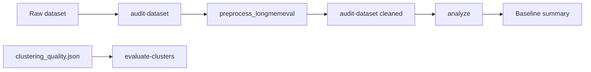

# Benchmark Workflow

Reproducible evidence pipeline for measuring how Mem-D behaves on real memory datasets.

This workflow orchestrates existing Mem-D commands only. It does not add metrics, categorization rules, or new intelligence layers.

## Pipeline overview



| Step | Command / script | Purpose |
| --- | --- | --- |
| 1. Raw audit | `memd audit-dataset` | Estimate meaningful memory rate, noise, Unknown rate, duplicate rate, preprocessing needs |
| 2. Preprocess | `scripts/preprocess_longmemeval.py` | Deterministically remove assistant turns, filler, excluded content, exact duplicates |
| 3. Cleaned audit | `memd audit-dataset` | Re-measure usefulness on cleaned export |
| 4. Analyze | `memd analyze` | Full Mem-D pipeline: categorization, clustering, metrics, validation, insights |
| 5. Cluster eval (optional) | `memd evaluate-clusters` | Labelled duplicate-clustering quality on `datasets/validation/clustering_quality.json` |

Steps 1–4 are bundled in `scripts/run_longmemeval_benchmark.py` for LongMemEval-style JSONL exports.

## Output directory

All benchmark artifacts live under `examples/benchmarks/`.

| Artifact | Pattern | Source step |
| --- | --- | --- |
| Raw audit (JSON) | `{stem}.audit.raw.json` | audit-dataset |
| Raw audit (Markdown) | `{stem}.audit.raw.md` | audit-dataset |
| Preprocess report (JSON) | `{stem}.preprocess-report.json` | preprocess |
| Preprocess report (Markdown) | `{stem}.preprocess-report.md` | preprocess |
| Cleaned dataset | `{stem}.cleaned.jsonl` | preprocess |
| Cleaned audit (JSON) | `{stem}.audit.cleaned.json` | audit-dataset |
| Cleaned audit (Markdown) | `{stem}.audit.cleaned.md` | audit-dataset |
| Analysis (JSON) | `{stem}.analysis.json` | analyze |
| Analysis (Markdown) | `{stem}.analysis.md` | analyze |
| Baseline summary | `{stem}.baseline.md` | generated from reports above |
| Cluster evaluation | `clustering_quality.cluster-eval.json` | evaluate-clusters (optional) |

`{stem}` is the input filename without extension (for example `longmemeval_sample`).

See [examples/benchmarks/BENCHMARK-BASELINE.md](../examples/benchmarks/BENCHMARK-BASELINE.md) for the baseline summary template.

## Quick run (LongMemEval)

Place a local LongMemEval JSONL export at `datasets/evaluation/longmemeval_sample.jsonl` (gitignored). Then:

```bash
python scripts/run_longmemeval_benchmark.py datasets/evaluation/longmemeval_sample.jsonl
```

Options:

```bash
python scripts/run_longmemeval_benchmark.py INPUT.jsonl \
  --output-dir examples/benchmarks \
  --stem longmemeval_sample \
  --threshold 0.55 \
  --model BAAI/bge-small-en-v1.5
```

## Manual step-by-step

### 1. Audit raw dataset

```bash
python -m memd audit-dataset datasets/evaluation/longmemeval_sample.jsonl \
  --format json \
  --output examples/benchmarks/longmemeval_sample.audit.raw.json

python -m memd audit-dataset datasets/evaluation/longmemeval_sample.jsonl \
  --format markdown \
  --output examples/benchmarks/longmemeval_sample.audit.raw.md
```

### 2. Preprocess

```bash
python scripts/preprocess_longmemeval.py datasets/evaluation/longmemeval_sample.jsonl \
  --output examples/benchmarks/longmemeval_sample.cleaned.jsonl \
  --report examples/benchmarks/longmemeval_sample.preprocess-report.json \
  --markdown-report examples/benchmarks/longmemeval_sample.preprocess-report.md
```

### 3. Audit cleaned dataset

```bash
python -m memd audit-dataset examples/benchmarks/longmemeval_sample.cleaned.jsonl \
  --format json \
  --output examples/benchmarks/longmemeval_sample.audit.cleaned.json
```

### 4. Analyze cleaned dataset

```bash
python -m memd analyze examples/benchmarks/longmemeval_sample.cleaned.jsonl \
  --format json \
  --output examples/benchmarks/longmemeval_sample.analysis.json

python -m memd analyze examples/benchmarks/longmemeval_sample.cleaned.jsonl \
  --format markdown \
  --output examples/benchmarks/longmemeval_sample.analysis.md
```

### 5. Evaluate clustering (labelled fixture)

Independent of any external dataset export. Uses ground-truth duplicate groups:

```bash
python -m memd evaluate-clusters datasets/validation/clustering_quality.json \
  --format json \
  --output examples/benchmarks/clustering_quality.cluster-eval.json

python -m memd evaluate-clusters datasets/validation/clustering_quality.json \
  --format markdown \
  --output examples/benchmarks/clustering_quality.cluster-eval.md
```

## Baseline summary

After steps 1–4, fill or regenerate `{stem}.baseline.md` using the sections in [BENCHMARK-BASELINE.md](../examples/benchmarks/BENCHMARK-BASELINE.md):

- Dataset
- Input Size
- Meaningful Memory Rate
- Unknown Rate
- Duplicate Rate
- Compression Opportunity
- Category Distribution
- Evolution Signals
- Lifecycle Distribution
- Insights Summary

`run_longmemeval_benchmark.py` writes this file automatically from existing report JSON.

## Related docs

- [DATASET-QUALITY-AUDIT.md](DATASET-QUALITY-AUDIT.md) — raw/cleaned audit semantics
- [CLUSTERING.md](clustering.md) — clustering evaluation metrics
- [MEMORY-EVOLUTION-AUDIT-V1.md](MEMORY-EVOLUTION-AUDIT-V1.md) — evolution signals in analyze output
- [MEMORY-LIFECYCLE-MODEL-V1.md](MEMORY-LIFECYCLE-MODEL-V1.md) — lifecycle distribution in analyze output

## Notes

- Mem-D is read-only; benchmark runs never modify source datasets.
- Large generated JSON and JSONL files may be gitignored locally; preprocess reports and baseline markdown can be committed as evidence snapshots.
- Re-run the full pipeline after Mem-D version changes to keep baselines comparable.
